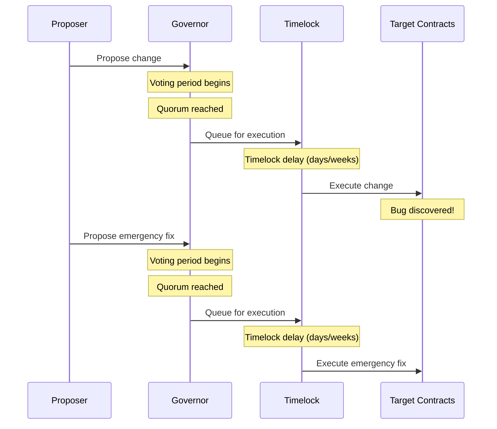
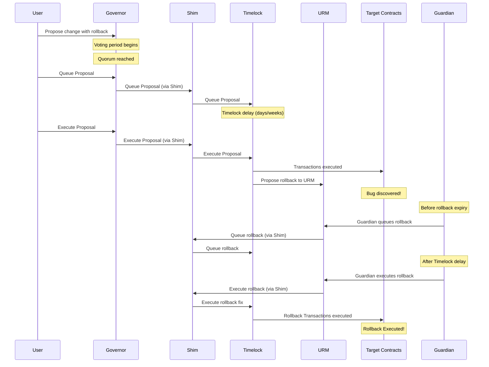
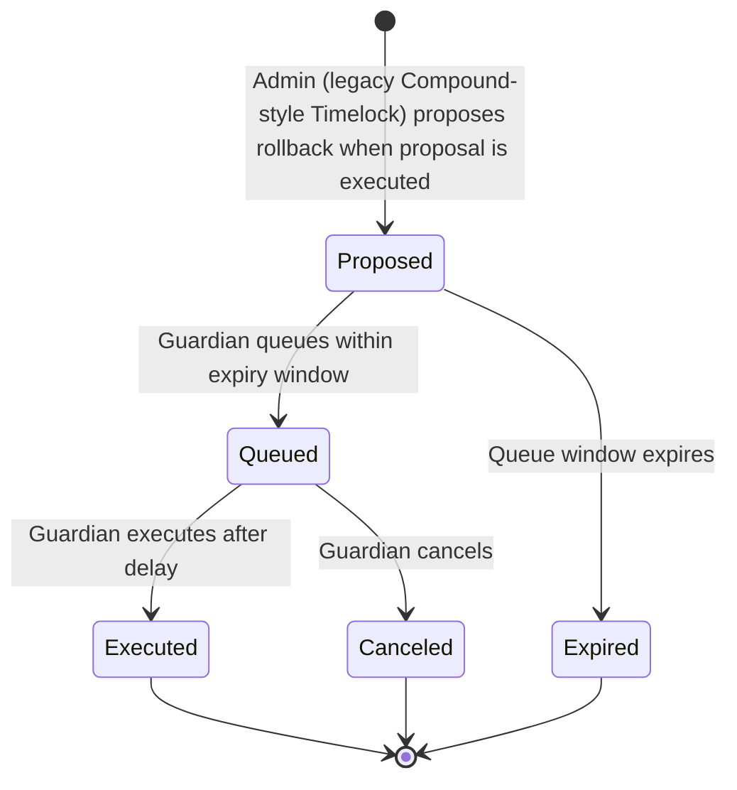

# Governance Emergency Rollback - Technical Design Document

> **⚠️ Development Status**: This repository is currently under active development and is **NOT** complete, audited, or ready for production use. The contracts and documentation are provided for research and development purposes only.

## Overview

The Governance Emergency Rollback system provides emergency rollback capabilities for executed governance proposals. This system allows DAOs to quickly reverse the effects of a governance proposal that is causing negative consequences to the protocol, whether due to misconfiguration, bugs, or other unexpected issues.

Currently, most DAOs operate with a single executor (the Governor) that can execute transactions through a Timelock. For DAOs that have a legacy, [Compound-style](https://github.com/ScopeLift/compound-governance-upgrade/blob/main/contracts/Timelock.sol) Timelock, only one admin executor is even possible.

The contracts in this repository aim to solve these problems:

1. **Single Executor Limitation**: Only the Governor can execute transactions through a legacy Compound-style Timelock, which is used by many well established DAOs.

2. **Long Lifecycle to Undo Governance Proposal Actions**: There is no mechanism for emergency rollback of executed governance proposals. When a recently executed proposal causes harm, the only recourse is to go through the full governance process again, which can take days or weeks. This delay can be catastrophic in emergency situations.

The TimelockMultiAdminShim addresses the first limitation by enabling multiple executors, while the Upgrade Regression Manager (URM) solves the actual rollback problem by providing emergency rollback capabilities.

## Actors

### Governance Actors

1. **Governor** - The governance contract that proposes and executes governance proposals
2. **Timelock** - The existing legacy Compound-style timelock contract that enforces delays on governance actions
3. **Proposers** - DAO members who create governance proposals

### URM Actors

1. **Guardian** - An address granted emergency capabilities for managing rollback transactions, including queuing, cancellation, and execution.
2. **Admin** - The address responsible for submitting rollback proposals to the URM. In the context of this system, the legacy Compound-style Timelock assumes this role.
3. **Target Contract** - The contract that is the recipient of rollback transactions, which can be queued, executed, or cancelled. The Shim serves as the target contract in this scenario.

### Shim Actors

1. **Executors** - Addresses authorized to execute and cancel transactions on the legacy Compound-style timelock, a role assumed by the URM in this system, though others could be added in the future by the admin.
2. **Admin** - The address responsible for managing the shim's configuration, including the management of executors and the proxying of proposals to the timelock on behalf of the executors. This role is fulfilled by the Governor, who possesses the same capabilities as the executors.
3. **Timelock** - The legacy Compound-style Timelock contract that is wrapped by the shim.

### System Components

1. **TimelockMultiAdminShim** - A contract that enables the management of proposals by multiple executors, including the Governor and URM, for a legacy Compound-style Timelock. It acts as an intermediary between the Governor and the Timelock, as well as between the URM and the Timelock.
2. **Upgrade Regression Manager (URM)** - The contract responsible for managing the lifecycle of rollback proposals, ensuring their proper execution and oversight.

## Architecture

### Before Architecture

#### Original Production Flow (Without Rollback System)



**Problems with Current Architecture:**
- Single executor (only Governor can execute)
- Rollback requires full governance cycle (days/weeks)


### After Architecture

#### New Production Flow (With Rollback System)



**Benefits of New Architecture:**
- Multiple executors can use the Timelock
- Emergency rollback capability with Guardian
- Conditional rollback execution within time windows
- Maintains existing governance security model
- Backward compatible with existing tooling
- **Rollbacks are proposed as part of governance proposals via double encoding**


## System Components

### 1. TimelockMultiAdminShim

* [Shim Interface](src/interfaces/ITimelockMultiAdminShim.sol)
* [Shim Implementation](src/contracts/TimelockMultiAdminShim.sol)

A shim contract that wraps the existing legacy Compound-style Timelock and adds support for multiple executors while maintaining the same interface

**Key Features:**
- Implements the same interface as the underlying legacy Compound-style Timelock
- Allows multiple authorized executors
- Maintains admin-only access for shim configuration
- Backward compatible with existing governance tooling

**Security Model:**
- Only the admin can queue transactions targeting the shim itself
- Admin and authorized executors can queue transactions targeting external contracts
- Only the legacy Compound-style Timelock can modify executor permissions

### 2. Upgrade Regression Manager (URM)

* [URM Interface](src/interfaces/IUpgradeRegressionManager.sol)
* [URM Implementation](src/contracts/UpgradeRegressionManager.sol)

The core contract that manages the lifecycle of rollback proposals.

**Key Features:**
- Propose rollback transactions with queueing expiration windows
- Queue rollback transactions for execution
- Execute or cancel queued rollbacks
- Guardian-controlled emergency execution
- Configurable queueing windows

**Security Model:**
- Only admin can propose rollbacks and manage settings
- Only guardian and admin can queue/execute/cancel rollbacks
- Queue windows prevent indefinite rollback availability
- Respect legacy Compound-style Timelock delays prevent immediate execution

## Rollback Lifecycle



### Detailed Lifecycle

1. **Proposal Creation**
   - Admin (legacy Compound-style Timelock) proposes rollback transactions via `propose()`
   - Rollback gets unique ID based on transaction parameters
   - Expiration timestamp set (current time + queue window)

2. **Queue Window**
   - Guardian can queue rollback within expiration window
   - If window expires, rollback becomes unqueueable
   - Guardian calls queue() to move to execution phase

3. **Execution Phase**
   - Rollback transactions queued in legacy Compound-style Timelock
   - Guardian can execute after timelock delay
   - Guardian can cancel before execution

## Deployment Process

1. **Deploy Contracts**
   Deploy the `TimelockMultiAdminShim` and `UpgradeRegressionManager (URM)`. Add URM as an executor in the Shim.

2. **Governance Proposal**
   Propose setting the Shim as:
   * Pending admin of the existing legacy Compound-style Timelock
   * New timelock for the Governor

3. **Accept Admin**
   Once the proposal executes, call `acceptAdmin()` on the Shim to complete the transfer.

## Integration with Governance

### Proposal Creation with Rollback

When creating a governance proposal, proposers include rollback transactions using a double-encoding mechanism. The rollback transactions are encoded as parameters to the URM's propose() function, which is then included as a transaction in the governance proposal.

**Example: Fee Management Proposal with Rollback**

Let's say we want to propose setting a fee level to 50, with a rollback that resets it to 0 if needed:

```javascript
// 1. Proposer creates rollback transaction data
address[] memory rollbackTargets = [feeManagerContract];
uint256[] memory rollbackValues = [0];
bytes[] memory rollbackCalldatas = [abi.encodeWithSignature("setFeeLevel(uint256)", 0)];
string memory rollbackDescription = "Emergency rollback: Reset fee level to 0";

// 2. Double-encode the rollback data as parameters to URM.propose()
bytes memory urmProposeCalldata = abi.encodeWithSignature(
    "propose(address[],uint256[],bytes[],string)",
    rollbackTargets,
    rollbackValues,
    rollbackCalldatas,
    rollbackDescription
);

// 3. Include both the main proposal and URM.propose() call in the governance proposal
address[] memory proposalTargets = [feeManagerContract, address(urm)];
uint256[] memory proposalValues = [0, 0];
bytes[] memory proposalCalldatas = [
    abi.encodeWithSignature("setFeeLevel(uint256)", 50),  // Main proposal: set fee to 50
    urmProposeCalldata                                     // Rollback proposal: reset fee to 0
];
string memory proposalDescription = "Set fee level to 50 with emergency rollback capability";
```

### Double-Encoding Mechanism

The double-encoding mechanism is used to package rollback transactions inside a governance proposal:

1. **First Encoding**: The actual rollback transactions — including target addresses, values, and calldata — are encoded as inputs to the propose() function of the Upgrade Regression Manager (URM).
2. **Second Encoding**: The URM propose() call itself is then encoded as a transaction within the broader governance proposal submitted to the Governor.

This approach ensures that if a rollback needs to be queued or executed, it follows the same lifecycle and governance protections as a regular proposal once it's in the queue.


### Emergency Execution

If an emergency rollback is required after a proposal has already been executed, the guardian initiates the rollback process by queuing the corresponding transactions through the Upgrade Regression Manager (URM). This action schedules the rollback for execution.

Once the configured legacy Compound-style Timelock delay has passed, the guardian can then execute the rollback. This effectively reverses the changes introduced by the original proposal, mitigating any negative impact it may have caused.


## Conclusion

The Governance Emergency Rollback system provides a secure, flexible, and backward-compatible solution for emergency rollback scenarios. By leveraging existing governance infrastructure and adding targeted emergency capabilities, the system maintains security while enabling rapid response to critical issues.

The architecture follows established patterns from OpenZeppelin Governor, ensuring consistency and familiarity for developers and auditors. The modular design allows for future enhancements while maintaining the core security model.

**[Governance Upgrade Impact Analysis](docs/GOVERNANCE_UPGRADE_IMPACT.md)** - Detailed analysis of how the governance upgrade affects existing proposals at different lifecycle stages

## Development

These contracts were built and tested with care by the team at [ScopeLift](https://scopelift.co).

### Build and test

This project uses [Foundry](https://github.com/foundry-rs/foundry). Follow [these instructions](https://github.com/foundry-rs/foundry#installation) to install it.

Clone the repo.

Set up your .env file

```bash
cp .env.example .env
# edit the .env to fill in values
```

Install dependencies & run tests.

```bash
forge install
forge build
forge test
```

### Spec and lint

This project uses [scopelint](https://github.com/ScopeLift/scopelint) for linting and spec generation. Follow [these instructions](https://github.com/ScopeLift/scopelint?tab=readme-ov-file#installation) to install it.

To use scopelint's linting functionality, run:

```bash
scopelint check # check formatting
scopelint fmt # apply formatting changes
```

To use scopelint's spec generation functionality, run:

```bash
scopelint spec
```

This command will use the names of the contract's unit tests to generate a human readable spec. It will list each contract, its constituent functions, and the human readable description of functionality each unit test aims to assert.

### Commit linting (optional)

This project includes [commitlint](https://commitlint.js.org/) configuration to enforce conventional commit format. The configuration extends `@commitlint/config-conventional` which enforces the [Conventional Commits](https://www.conventionalcommits.org/) specification.

To enable commit linting in your development workflow:

1. **Install dependencies** (if not already installed):
   ```bash
   pnpm install
   ```

2. **Set up the pre-commit hook** (already configured in package.json):
   ```bash
   pnpm run prepare
   ```

3. **Use conventional commit format** for your commits:
   ```bash
   git commit -m "feat: add new rollback functionality"
   git commit -m "fix: resolve invariant test failure"
   git commit -m "docs: update README with commit linting info"
   ```

Common commit types include:
- `feat`: New features
- `fix`: Bug fixes
- `docs`: Documentation changes
- `style`: Code style changes (formatting, etc.)
- `refactor`: Code refactoring
- `test`: Adding or updating tests
- `chore`: Maintenance tasks


## License

The code in this repository is licensed under the [MIT](LICENSE.txt) unless otherwise indicated.

Copyright (C) 2025 ScopeLift
