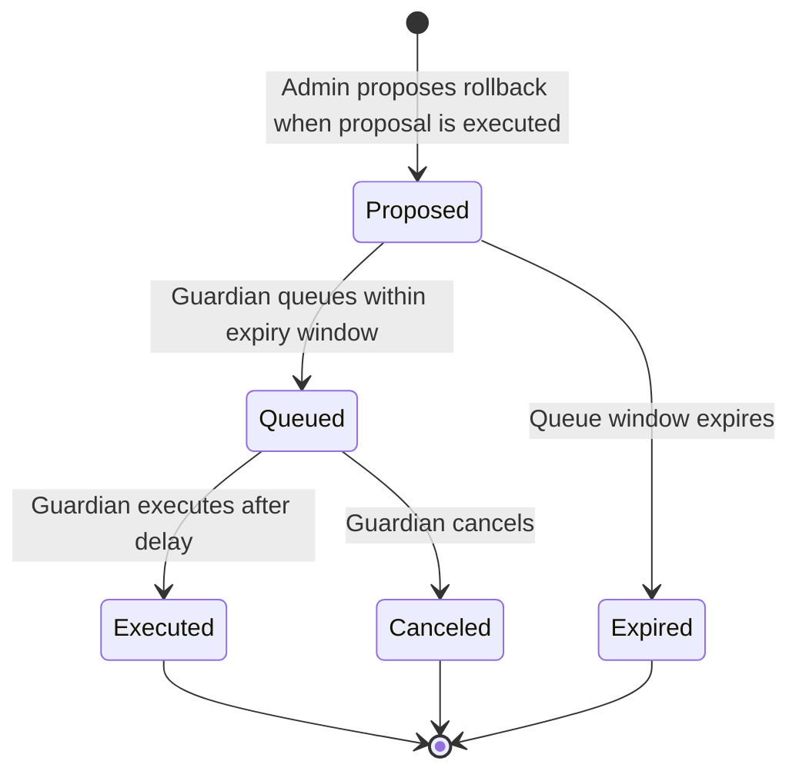

# Governance Emergency Rollback - Technical Design Document

> **⚠️ Development Status**: This repository is currently under active development and is **NOT** complete, audited, or ready for production use. The contracts and documentation are provided for research and development purposes only.

## Overview

The Governance Emergency Rollback system provides emergency rollback capabilities for executed governance proposals. This system allows DAOs to quickly reverse the effects of a governance proposal that is causing negative consequences to the protocol, whether due to misconfiguration, bugs, or other unexpected issues.

The system supports two different governance flavors:

- **[Compound Governance](docs/COMPOUND_URM.md)** - For DAOs using legacy Compound-style governance with single-executor timelocks
- **[OpenZeppelin Governance](docs/OZ_URM.md)** - For DAOs using OpenZeppelin Governor with multi-executor timelocks

## Universal Rollback Manager (URM)

The **Universal Rollback Manager (URM)** is the core contract that manages the lifecycle of rollback proposals, ensuring their proper execution and oversight across different governance systems.

### Key Features

- **Propose rollback transactions** with queueing expiration windows
- **Queue rollback transactions** for execution
- **Execute or cancel queued rollbacks**
- **Guardian-controlled emergency execution**
- **Configurable queueing windows**

### Security Model

- Only admin can propose rollbacks and manage settings
- Only guardian and admin can queue/execute/cancel rollbacks
- Queue windows prevent indefinite rollback availability
- Respects existing timelock delays to prevent immediate execution

## Rollback Lifecycle



### Detailed Lifecycle

1. **Proposal Creation**
   - Admin proposes rollback transactions via `propose()`
   - Rollback gets unique ID based on transaction parameters
   - Expiration timestamp set (current time + queue window)

2. **Queue Window**
   - Guardian can queue rollback within expiration window
   - If window expires, rollback becomes unqueueable
   - Guardian calls queue() to move to execution phase

3. **Execution Phase**
   - Rollback transactions queued in the underlying timelock
   - Guardian can execute after timelock delay
   - Guardian can cancel before execution

## Integration with Governance

### Proposal Creation with Rollback

When creating a governance proposal, proposers include rollback transactions using a double-encoding mechanism. The rollback transactions are encoded as parameters to the URM's propose() function, which is then included as a transaction in the governance proposal.

**Example: Fee Management Proposal with Rollback**

Let's say we want to propose setting a fee level to 50, with a rollback that resets it to 0 if needed:

```javascript
// 1. Proposer creates rollback transaction data
address[] memory rollbackTargets = [feeManagerContract];
uint256[] memory rollbackValues = [0];
bytes[] memory rollbackCalldatas = [abi.encodeWithSignature("setFeeLevel(uint256)", 0)];
string memory rollbackDescription = "Emergency rollback: Reset fee level to 0";

// 2. Double-encode the rollback data as parameters to URM.propose()
bytes memory urmProposeCalldata = abi.encodeWithSignature(
    "propose(address[],uint256[],bytes[],string)",
    rollbackTargets,
    rollbackValues,
    rollbackCalldatas,
    rollbackDescription
);

// 3. Include both the main proposal and URM.propose() call in the governance proposal
address[] memory proposalTargets = [feeManagerContract, address(urm)];
uint256[] memory proposalValues = [0, 0];
bytes[] memory proposalCalldatas = [
    abi.encodeWithSignature("setFeeLevel(uint256)", 50),  // Main proposal: set fee to 50
    urmProposeCalldata                                     // Rollback proposal: reset fee to 0
];
string memory proposalDescription = "Set fee level to 50 with emergency rollback capability";
```

### Double-Encoding Mechanism

The double-encoding mechanism is used to package rollback transactions inside a governance proposal:

1. **First Encoding**: The actual rollback transactions — including target addresses, values, and calldata — are encoded as inputs to the propose() function of the Universal Rollback Manager (URM).
2. **Second Encoding**: The URM propose() call itself is then encoded as a transaction within the broader governance proposal submitted to the Governor.

This approach ensures that if a rollback needs to be queued or executed, it follows the same lifecycle and governance protections as a regular proposal once it's in the queue.

### Emergency Execution

If an emergency rollback is required after a proposal has already been executed, the guardian initiates the rollback process by queuing the corresponding transactions through the Universal Rollback Manager (URM). This action schedules the rollback for execution.

Once the configured timelock delay has passed, the guardian can then execute the rollback. This effectively reverses the changes introduced by the original proposal, mitigating any negative impact it may have caused.

## Implementation Flavors

### Compound Governance

For DAOs using legacy Compound-style governance systems, the URM integrates with a **TimelockMultiAdminShim** to enable multiple executors on single-executor timelocks.

**[View Compound Implementation Details](docs/COMPOUND_URM.md)**

### OpenZeppelin Governance

For DAOs using OpenZeppelin Governor systems, the URM integrates directly with the existing multi-executor timelock infrastructure.

**[View OpenZeppelin Implementation Details](docs/OZ_URM.md)**

## System Components

### Universal Rollback Manager (URM)

* [URM Interface](src/interfaces/IURM.sol)
* [URM Core Implementation](src/contracts/URMCore.sol)
* [Compound Manager](src/contracts/urm/URMCompoundManager.sol)
* [OpenZeppelin Manager](src/contracts/urm/URMOZManager.sol)

The core contract that manages the lifecycle of rollback proposals across different governance systems.

## Conclusion

The Governance Emergency Rollback system provides a secure, flexible, and backward-compatible solution for emergency rollback scenarios. By leveraging existing governance infrastructure and adding targeted emergency capabilities, the system maintains security while enabling rapid response to critical issues.

The architecture follows established patterns from OpenZeppelin Governor, ensuring consistency and familiarity for developers and auditors. The modular design allows for future enhancements while maintaining the core security model.

## Development

These contracts were built and tested with care by the team at [ScopeLift](https://scopelift.co).

### Build and test

This project uses [Foundry](https://github.com/foundry-rs/foundry). Follow [these instructions](https://github.com/foundry-rs/foundry#installation) to install it.

Clone the repo.

Set up your .env file

```bash
cp .env.example .env
# edit the .env to fill in values
```

Install dependencies & run tests.

```bash
forge install
forge build
forge test
```

### Spec and lint

This project uses [scopelint](https://github.com/ScopeLift/scopelint) for linting and spec generation. Follow [these instructions](https://github.com/ScopeLift/scopelint?tab=readme-ov-file#installation) to install it.

To use scopelint's linting functionality, run:

```bash
scopelint check # check formatting
scopelint fmt # apply formatting changes
```

To use scopelint's spec generation functionality, run:

```bash
scopelint spec
```

This command will use the names of the contract's unit tests to generate a human readable spec. It will list each contract, its constituent functions, and the human readable description of functionality each unit test aims to assert.

### Commit linting (optional)

This project includes [commitlint](https://commitlint.js.org/) configuration to enforce conventional commit format. The configuration extends `@commitlint/config-conventional` which enforces the [Conventional Commits](https://www.conventionalcommits.org/) specification.

To enable commit linting in your development workflow:

1. **Install dependencies** (if not already installed):
   ```bash
   pnpm install
   ```

2. **Set up the pre-commit hook** (already configured in package.json):
   ```bash
   pnpm run prepare
   ```

3. **Use conventional commit format** for your commits:
   ```bash
   git commit -m "feat: add new rollback functionality"
   git commit -m "fix: resolve invariant test failure"
   git commit -m "docs: update README with commit linting info"
   ```

Common commit types include:
- `feat`: New features
- `fix`: Bug fixes
- `docs`: Documentation changes
- `style`: Code style changes (formatting, etc.)
- `refactor`: Code refactoring
- `test`: Adding or updating tests
- `chore`: Maintenance tasks

## License

The code in this repository is licensed under the [MIT](LICENSE.txt) unless otherwise indicated.

Copyright (C) 2025 ScopeLift
