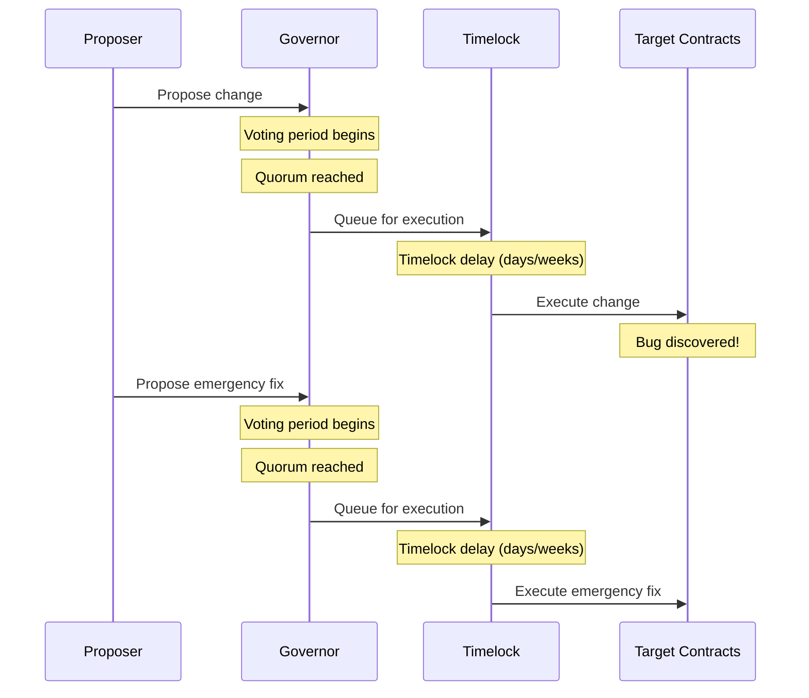
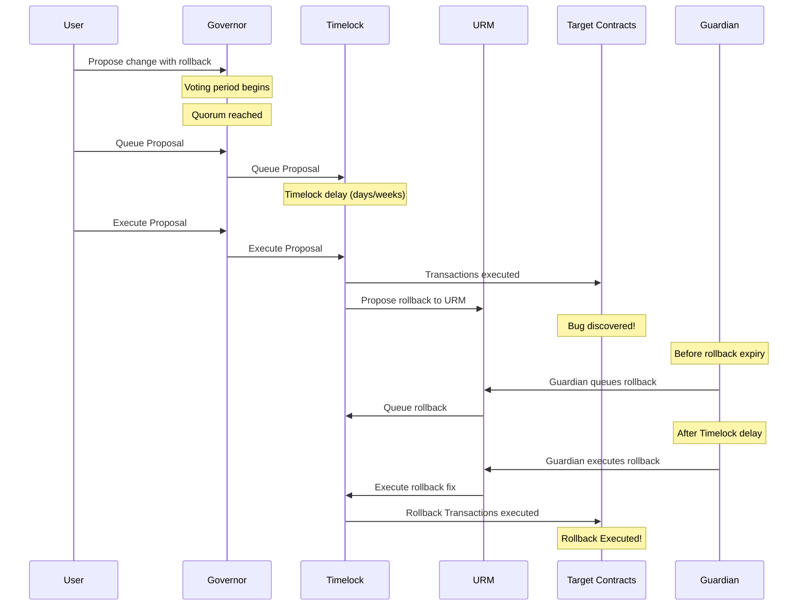

# OpenZeppelin Governance URM Implementation

This document describes the OpenZeppelin-specific implementation of the Universal Rollback Manager (URM) for DAOs using OpenZeppelin Governor systems.

## Overview

For DAOs using OpenZeppelin Governor systems, the URM integrates directly with the existing multi-executor timelock infrastructure. This upgrade path is simpler than the Compound version: since OpenZeppelin Governor already supports multiple executors,there's no need to deploy a shim.

## Architecture

### Before Architecture

#### Original Production Flow (Without Rollback System)

**Problems with Current Architecture:**
- No emergency rollback mechanism
- Rollback requires full governance cycle (days/weeks)

### After Architecture

#### New Production Flow (With Rollback System)

**Benefits of New Architecture:**
- Emergency rollback capability with Guardian
- Conditional rollback execution within time windows
- Maintains existing governance security model
- Backward compatible with existing tooling
- **Rollbacks are proposed as part of governance proposals via double encoding**

## Actors

### Governance Actors

1. **Governor** - The governance contract that proposes and executes governance proposals
2. **Timelock** - The existing OpenZeppelin TimelockController that enforces delays on governance actions
3. **Proposers** - DAO members who create governance proposals

### URM Actors

1. **Guardian** - An address granted emergency capabilities for managing rollback transactions, including queuing, cancellation, and execution.
2. **Admin** - The address responsible for submitting rollback proposals to the URM. In the context of this system, the OpenZeppelin TimelockController assumes this role.
3. **Target Contract** - The contract that is the recipient of rollback transactions, which can be queued, executed, or cancelled.

## System Components

### Universal Rollback Manager (URM)

* [URM Interface](../src/interfaces/IURM.sol)
* [URM Core Implementation](../src/contracts/URMCore.sol)
* [OpenZeppelin Manager](../src/contracts/urm/URMOZManager.sol)

The core contract that manages the lifecycle of rollback proposals.

**Key Features:**
- Propose rollback transactions with queueing expiration windows
- Queue rollback transactions for execution
- Execute or cancel queued rollbacks
- Guardian-controlled emergency execution
- Configurable queueing windows

**Security Model:**
- Only admin can propose rollbacks and manage settings
- Only guardian and admin can queue/execute/cancel rollbacks
- Queue windows prevent indefinite rollback availability
- Respects OpenZeppelin TimelockController delays to prevent immediate execution

## Deployment Process

1. **Deploy URM**
   Deploy the `URMCore` with `URMOZManager` contract.

2. **Configure URM**
   Set the URM as an executor in the existing OpenZeppelin TimelockController.

3. **Grant Guardian Role**
   Grant the guardian role to the designated emergency address.

## OZ-Specific Considerations

### Multi-Executor Support

Unlike the Compound implementation, OpenZeppelin Governor systems already support multiple executors, so no shim is required. The URM can be added directly as an executor to the existing TimelockController.

### TimelockController Integration

The OpenZeppelin implementation leverages the existing TimelockController's multi-executor capabilities, making the integration simpler and more straightforward than the Compound version.

### Deployment Scripts

* [Deploy URM](../script/1_DeployURMOZ.s.sol)
* [Grant Roles to URM](../script/2_GrantRolesToURMOZ.s.sol)

## Testing

The OpenZeppelin implementation includes comprehensive testing:

* [Integration Tests](../test/URMOZDeployment.integration.t.sol)
* [Unit Tests](../test/URMOZManager.unit.t.sol) 