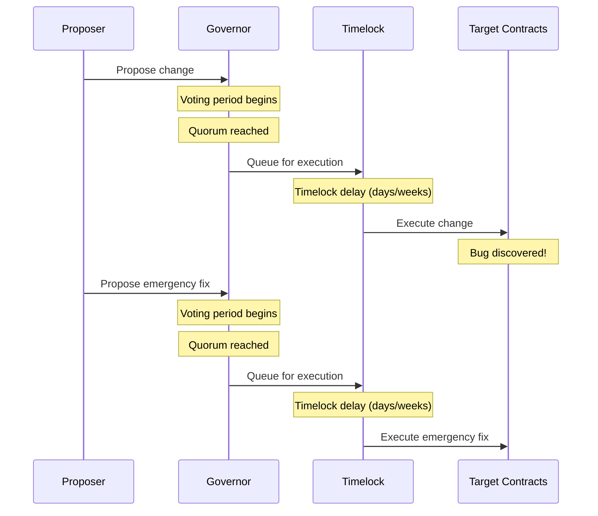
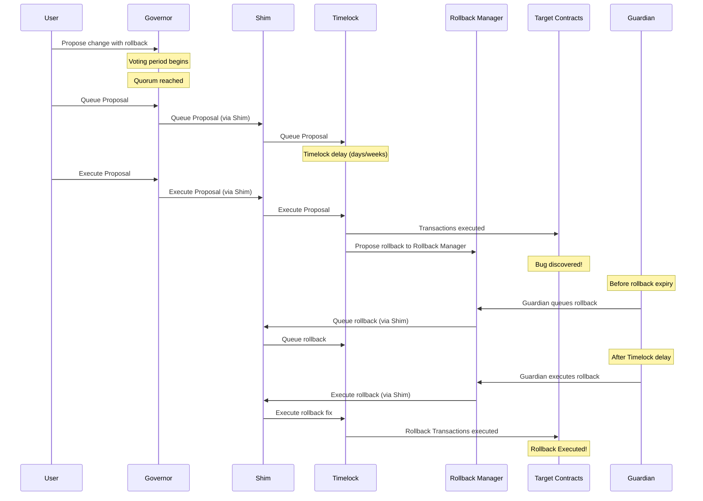

# Compound Governance Rollback Manager Implementation

This document describes the Compound-specific implementation of the Rollback Manager for DAOs using legacy Compound-style governance systems.

## Overview

For DAOs using legacy Compound-style governance, the Rollback Manager integrates with a **TimelockMultiAdminShim** to enable multiple executors on single-executor timelocks. This addresses the fundamental limitation of Compound-style timelocks that only support a single admin executor.

## Architecture

### Before Architecture

#### Original Production Flow (Without Rollback System)

**Problems with Current Architecture:**
- Single executor (only Governor can execute)
- Rollback requires full governance cycle (days/weeks)

### After Architecture

#### New Production Flow (With Rollback System)

**Benefits of New Architecture:**
- Multiple executors can use the Timelock
- Emergency rollback capability with Guardian
- Conditional rollback execution within time windows
- Maintains existing governance security model
- Backward compatible with existing tooling
- **Rollbacks are proposed as part of governance proposals via double encoding**

## Actors

### Governance Actors

1. **Governor** - The governance contract that proposes and executes governance proposals
2. **Timelock** - The existing legacy Compound-style timelock contract that enforces delays on governance actions
3. **Proposers** - DAO members who create governance proposals

### Rollback Manager Actors

1. **Guardian** - An address granted emergency capabilities for managing rollback transactions, including queuing, cancellation, and execution.
2. **Admin** - The address responsible for submitting rollback proposals to the Rollback Manager. In the context of this system, the legacy Compound-style Timelock assumes this role.
3. **Target Contract** - The contract that is the recipient of rollback transactions, which can be queued, executed, or cancelled. The Shim serves as the target contract in this scenario.

### Shim Actors

1. **Executors** - Addresses authorized to execute and cancel transactions on the legacy Compound-style timelock, a role assumed by the Rollback Manager in this system, though others could be added in the future by the admin.
2. **Admin** - The address responsible for managing the shim's configuration, including the management of executors and the proxying of proposals to the timelock on behalf of the executors. This role is fulfilled by the Governor, who possesses the same capabilities as the executors.
3. **Timelock** - The legacy Compound-style Timelock contract that is wrapped by the shim.

## System Components

### 1. TimelockMultiAdminShim

* [Shim Interface](../src/interfaces/ITimelockMultiAdminShim.sol)
* [Shim Implementation](../src/contracts/TimelockMultiAdminShim.sol)

A shim contract that wraps the existing legacy Compound-style Timelock and adds support for multiple executors while maintaining the same interface.

**Key Features:**
- Implements the same interface as the underlying legacy Compound-style Timelock
- Allows multiple authorized executors
- Maintains admin-only access for shim configuration
- Backward compatible with existing governance tooling

**Security Model:**
- Only the admin can queue transactions targeting the shim itself
- Admin and authorized executors can queue transactions targeting external contracts
- Only the legacy Compound-style Timelock can modify executor permissions

### 2. Rollback Manager

* [Rollback Manager Interface](../src/interfaces/IRollbackManager.sol)
* [Rollback Manager Core Implementation](../src/RollbackManager.sol)
* [Compound Manager](../src/RollbackManagerTimelockCompound.sol)

The core contract that manages the lifecycle of rollback proposals.

**Key Features:**
- Propose rollback transactions with queueing expiration windows
- Queue rollback transactions for execution
- Execute or cancel queued rollbacks
- Guardian-controlled emergency execution
- Configurable queueing windows

**Security Model:**
- Only admin can propose rollbacks and manage settings
- Only guardian and admin can queue/execute/cancel rollbacks
- Queue windows prevent indefinite rollback availability
- Respects legacy Compound-style Timelock delays to prevent immediate execution

## Deployment Process

1. **Deploy Contracts**
   Deploy the `TimelockMultiAdminShim` and `RollbackManager` with `RollbackManagerTimelockCompound`. Add Rollback Manager as an executor in the Shim.

2. **Governance Proposal**
   Propose setting the Shim as:
   * Pending admin of the existing legacy Compound-style Timelock
   * New timelock for the Governor

3. **Accept Admin**
   Once the proposal executes, call `acceptAdmin()` on the Shim to complete the transfer.

## Compound-Specific Considerations

### Governance Upgrade Impact

When upgrading from Compound Governor Bravo to Compound Governor, existing proposals at different lifecycle stages are affected differently. 

**[View Compound Governance Upgrade Impact Analysis](COMPOUND_GOVERNANCE_UPGRADE_IMPACT.md)** - Detailed analysis of how the governance upgrade affects existing proposals at different lifecycle stages.

### Legacy Timelock Integration

The Compound implementation requires special handling for legacy timelocks that only support single executors. The TimelockMultiAdminShim provides the necessary abstraction layer to enable multiple executors while maintaining backward compatibility.

### Deployment Scripts

* [Deploy Shim and Rollback Manager](../script/1_DeployShimAndRollbackManagerTimelockCompound.s.sol)
* [Grant Roles to Rollback Manager](../script/2_GrantRolesToRollbackManagerTimelockControl.s.sol)
* [Accept Admin](../script/3_AcceptAdmin.s.sol)

## Testing

The Compound implementation includes comprehensive testing:

* [Integration Tests](../test/RollbackManagerTimelockCompoundDeployment.integration.t.sol)
* [Unit Tests](../test/RollbackManagerTimelockCompound.unit.t.sol)
* [Governance Upgrade Impact Tests](../test/CompoundGovernanceUpgradeImpact.integration.t.sol) 